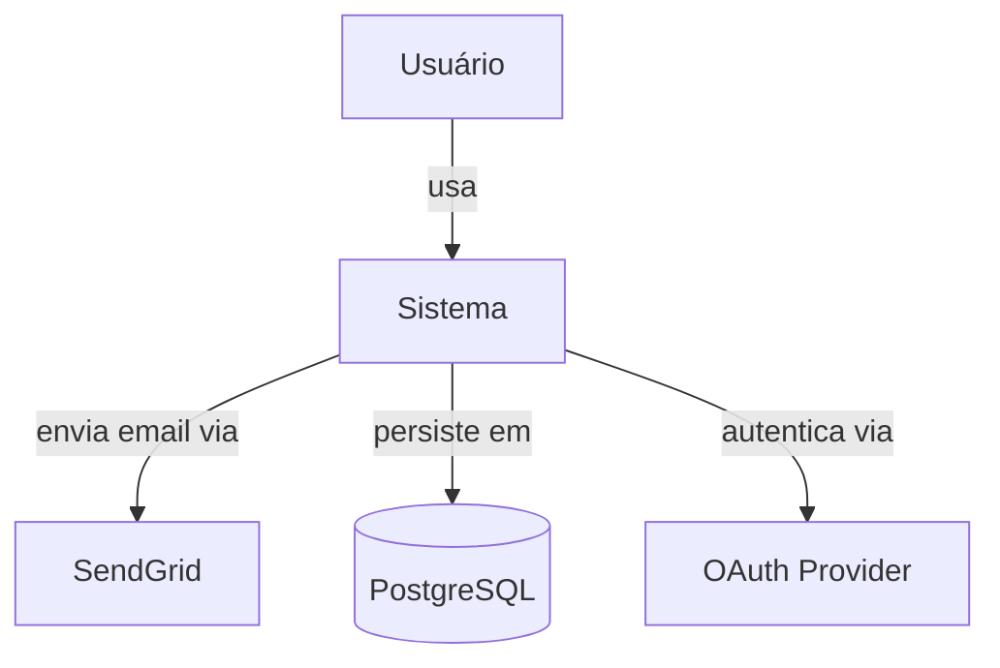
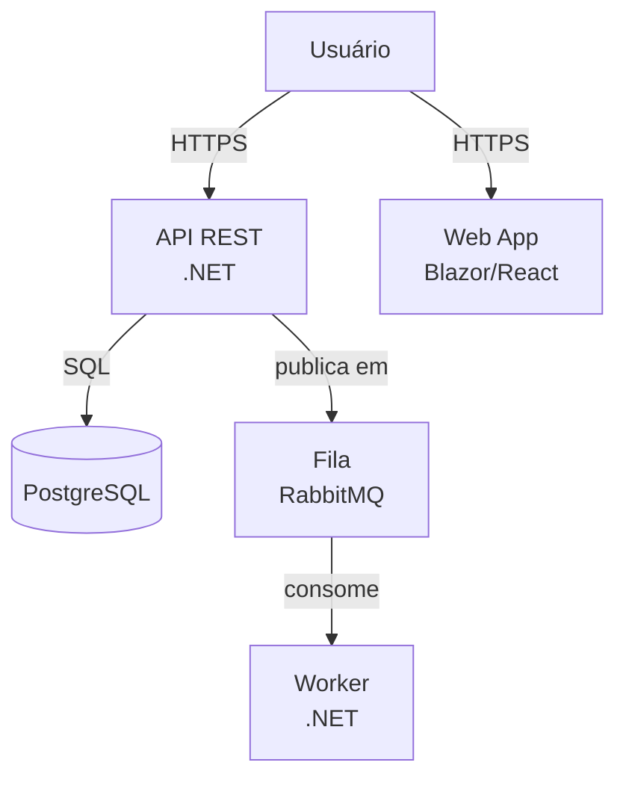
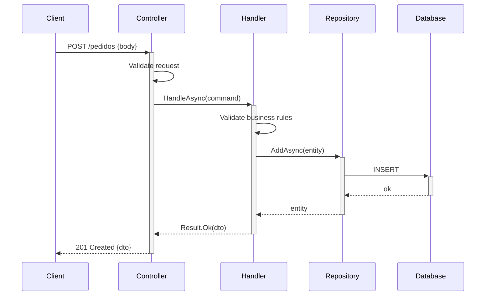

# Skill: Architecture Design

Processo estruturado para decisões arquiteturais — de small designs a ADRs formais.

## Como ativar

`/arch` ou mencionar "decisão de arquitetura", "como estruturar", "qual padrão usar"

## Quando usar

| Situação | Ação |
|----------|------|
| Nova feature com 3+ componentes | Small design (design.md) |
| Decisão com trade-offs relevantes | ADR formal |
| Mudança de padrão existente | ADR + atualizar documentação |
| Escolha de tecnologia/biblioteca | ADR com comparativo |
| Qualquer mudança irreversível | ADR obrigatório |

## Processo de decisão

### Etapa 1 — Entender o problema antes de propor solução

```
❌ "Vou usar microserviços para isso"
✅ Primeiro responder:
   - Qual é o problema que a arquitetura precisa resolver?
   - Quais são as restrições (time, custo, expertise da equipe)?
   - O que pode mudar no futuro (scale, novos domínios)?
   - O que definitivamente não vai mudar?
```

### Etapa 2 — Mapear alternativas

Para cada decisão, identificar no mínimo 2 alternativas e avaliar:

```
Critérios de avaliação:
- Complexidade de implementação
- Custo de manutenção
- Facilidade de teste
- Performance
- Familiaridade da equipe
- Reversibilidade (se a decisão se provar errada)
```

### Etapa 3 — Decidir e documentar

Nunca decidir sem documentar. Uma decisão sem contexto é uma armadilha para o futuro.

## Padrões arquiteturais — quando usar cada um

### Layered Architecture (default)
```
Usar quando:
✅ CRUD com regras de negócio moderadas
✅ Time pequeno, necessidade de produtividade
✅ Domínio bem entendido desde o início
✅ Requisitos de escala não extremos

Não usar quando:
❌ Múltiplos bounded contexts com regras muito diferentes
❌ Necessidade de escala horizontal independente por domínio
```

### CQRS (Command Query Responsibility Segregation)
```
Usar quando:
✅ Leitura e escrita têm requisitos muito diferentes
✅ Necessidade de múltiplas projeções do mesmo dado
✅ Alta carga de leitura vs escrita

Não usar quando:
❌ CRUD simples — adiciona complexidade sem benefício
❌ Time sem experiência prévia com o padrão
```

### DDD (Domain-Driven Design)
```
Usar quando:
✅ Domínio complexo com muitas regras de negócio
✅ Múltiplos bounded contexts claramente delimitados
✅ Time com acesso frequente a domain experts

Não usar quando:
❌ CRUD simples
❌ Domínio pequeno e bem entendido
❌ Prototipagem / MVP
```

### Event-Driven
```
Usar quando:
✅ Necessidade de desacoplamento entre serviços
✅ Operações assíncronas de longa duração
✅ Integração com múltiplos sistemas externos

Não usar quando:
❌ Fluxos síncronos simples — adiciona latência e complexidade
❌ Necessidade de consistência imediata
```

## Diagramas essenciais

### C4 Level 1 — Contexto do sistema


### C4 Level 2 — Containers


### Fluxo de dados


## Template ADR completo

```markdown
# ADR-NNN: [Título — decisão em uma frase]

**Data:** YYYY-MM-DD
**Autor:** [nome]
**Status:** Proposto | Aceito | Depreciado | Substituído por ADR-NNN
**Contexto:** [módulo/feature afetada]

---

## Contexto

[Descrição do problema ou situação que motivou esta decisão.
Inclua as forças em jogo: requisitos técnicos, restrições, necessidades de negócio.]

## Alternativas Consideradas

### Opção A: [nome]
[Descrição breve]

**Prós:**
- [ponto positivo]
- [ponto positivo]

**Contras:**
- [ponto negativo]
- [ponto negativo]

### Opção B: [nome]
[Descrição breve]

**Prós:** ...
**Contras:** ...

## Decisão

**Escolhemos:** [Opção X]

**Justificativa:**
[Por que esta opção ganhou sobre as outras. Seja específico sobre
os critérios que mais pesaram na decisão.]

## Consequências

**Positivas:**
- [benefício esperado]

**Negativas / trade-offs:**
- [custo ou limitação aceita]

**Riscos:**
- [o que pode dar errado e como mitigar]

**Ações necessárias:**
- [ ] [ação de implementação]
- [ ] [documentação a atualizar]
```

## Checklist de decisão arquitetural

Antes de finalizar qualquer decisão:
- [ ] O problema está bem definido (não a solução)?
- [ ] Pelo menos 2 alternativas foram consideradas?
- [ ] Os trade-offs estão documentados?
- [ ] A decisão é reversível ou irreversível?
- [ ] O time tem o conhecimento para implementar?
- [ ] A decisão está alinhada com a arquitetura existente?
- [ ] Um ADR foi criado (se decisão relevante)?
