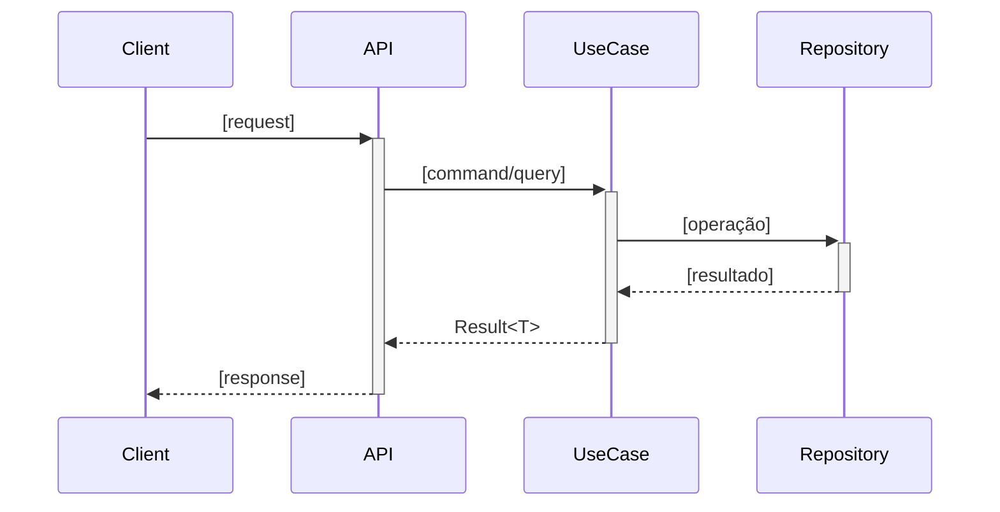

# Skill: Spec-Driven Development

Fluxo de desenvolvimento guiado por especificação — requirements → design → tasks → implementação.

## Como ativar

`/spec` ou mencionar "criar spec", "especificar feature", "planejar implementação"

## Quando criar spec

| Situação | Criar spec? |
|----------|-------------|
| Feature com 3+ classes ou componentes | ✅ Sim |
| Trabalho estimado > 4 horas | ✅ Sim |
| Mudança em contrato de API ou banco | ✅ Sim |
| Qualquer mudança irreversível | ✅ Sim |
| Bugfix simples (1-2 arquivos) | ❌ Não |
| Ajuste de configuração | ❌ Não |

## Estrutura de uma spec

```
.kiro/specs/<nome-da-feature>/
├── requirements.md     ← User stories + critérios de aceite
├── design.md           ← Arquitetura + modelagem + fluxos
└── tasks.md            ← Tarefas priorizadas e estimadas
```

## Template: requirements.md

```markdown
# Requirements — [Nome da Feature]

## Contexto
[Por que esta feature existe. Qual problema resolve.]

## User Stories

### US-01: [Título]
**Como** [usuário]
**Quero** [ação]
**Para** [valor]

**Critérios de Aceite:**
- CA-01: [Dado/Quando/Então]
- CA-02: [...]

**Fora do escopo:** [o que esta story NÃO faz]

### US-02: [...]

## Regras de Negócio
| ID | Regra |
|----|-------|
| RN-01 | [regra objetiva] |

## NFRs
- Performance: [ex: < 500ms para listagem com 10k registros]
- Segurança: [ex: apenas usuários autenticados]
```

## Template: design.md

```markdown
# Design — [Nome da Feature]

## Arquitetura

### Componentes afetados
- [Componente 1] — [o que muda]
- [Componente 2] — [o que é criado]

### Fluxo principal


### Modelo de dados
```mermaid
erDiagram
    [ENTIDADE_A] ||--o{ [ENTIDADE_B] : "relação"
    [ENTIDADE_A] {
        uuid id PK
        varchar campo
        timestamptz created_at
    }
```

## Decisões de Design

| Decisão | Alternativa considerada | Motivo da escolha |
|---------|------------------------|------------------|
| [decisão] | [alternativa] | [razão] |

## Impacto em código existente
- [arquivo/módulo] — [o que muda e por que]
```

## Template: tasks.md

```markdown
# Tasks — [Nome da Feature]

## Fase 1 — Domínio e Application

- [ ] **Task 1.1** — Criar entidade [Nome] com regras de negócio
  - Arquivos: `Domain/Entities/[Nome].cs`
  - Critérios: [CA-01], [CA-02]
  - Estimativa: P

- [ ] **Task 1.2** — Criar use case [Ação][Nome]
  - Arquivos: `Application/UseCases/[Nome]/`
  - Critérios: [CA-03]
  - Estimativa: M

## Fase 2 — Infrastructure

- [ ] **Task 2.1** — Criar repositório e migration
  - Arquivos: `Infrastructure/Persistence/`
  - Estimativa: M

## Fase 3 — API e Testes

- [ ] **Task 3.1** — Criar endpoint [MÉTODO] /[rota]
  - Arquivos: `Api/Controllers/`
  - Estimativa: P

- [ ] **Task 3.2** — Testes unitários e integração
  - Arquivos: `tests/`
  - Cobertura alvo: 85%
  - Estimativa: M

## Estimativas
| Tamanho | Horas |
|---------|-------|
| P (Pequeno) | 1-2h |
| M (Médio) | 2-4h |
| G (Grande) | 4-8h |
```

## Processo completo

```
1. Elicitar requisitos (US + CAs + RNs)
          ↓
2. Gerar requirements.md
          ↓
3. Revisar com usuário — aguardar aprovação
          ↓
4. Gerar design.md (arquitetura + diagramas)
          ↓
5. Revisar design — aguardar aprovação
          ↓
6. Gerar tasks.md (breakdown de implementação)
          ↓
7. Implementar task por task (com build + testes a cada uma)
          ↓
8. Validar critérios de aceite ao final de cada task
```

**Regra:** Nunca implementar sem requirements aprovados. Nunca implementar sem design revisado.
