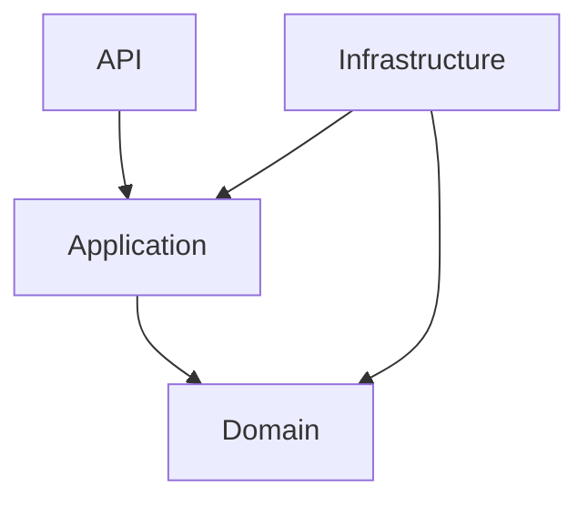
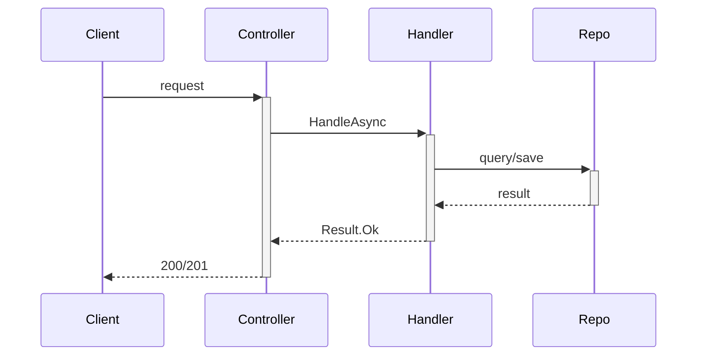

# Skill: Architecture Design

## Quando usar cada padrão

| Padrão | Usar quando | Não usar quando |
|--------|------------|----------------|
| Layered | CRUD com regras moderadas, time pequeno | Múltiplos bounded contexts complexos |
| CQRS | Leitura e escrita com requisitos muito diferentes | CRUD simples |
| DDD | Domínio complexo, múltiplos bounded contexts | Projeto pequeno bem entendido |
| Event-Driven | Desacoplamento entre serviços, operações assíncronas | Fluxos síncronos simples |
| Microserviços | Times independentes, deploy separado real | Prototipagem, time pequeno |

**Regra:** Começar simples. Adicionar complexidade quando a dor for real.

## Clean Architecture

```
Domain        ← ZERO dependências externas
    ↑
Application   ← depende apenas de Domain
    ↑
Infrastructure← implementa interfaces de Application
    ↑
Api/Presentation ← camada fina de entrada/saída
```

## Diagramas Mermaid essenciais





## Template ADR

```markdown
# ADR-NNN: [Título]
**Data:** YYYY-MM-DD | **Status:** Proposto | Aceito | Depreciado

## Contexto
[Problema que motivou a decisão]

## Alternativas
| Opção | Prós | Contras |
|-------|------|---------|
| A | ... | ... |
| B | ... | ... |

## Decisão
[O que foi escolhido e por quê]

## Consequências
**Positivas:** [lista]
**Trade-offs:** [lista]
```

## Checklist

- [ ] Dependency Rule respeitada
- [ ] Controllers thin
- [ ] Interfaces em Application, implementações em Infrastructure
- [ ] Result Pattern em todos os use cases
- [ ] Logging e auditoria planejados
- [ ] ADR para decisões relevantes
